# JobNexus — MERN Job Portal & Resume Builder

<p align="center">
  A full-stack MERN platform that combines job discovery, hiring workflows, and an ATS-friendly resume builder in one seamless experience.
</p>

<p align="center">
  
  
  
  
  
  
  
</p>

---

## Live Demo

- **Frontend:** [JobNexus App](https://job-portal-resume-builder.vercel.app)
- **Backend API:** [JobNexus Backend](https://job-portal-backend-hptt.onrender.com)

---

## Table of Contents

- [Overview](#overview)
- [Key Highlights](#key-highlights)
- [Features](#features)
  - [Candidate Features](#candidate-features)
  - [Employer Features](#employer-features)
  - [Admin Features](#admin-features)
  - [Resume Builder Features](#resume-builder-features)
- [Tech Stack](#tech-stack)
- [Project Structure](#project-structure)
- [API Modules](#api-modules)
- [Authentication & Session Strategy](#authentication--session-strategy)
- [Local Setup](#local-setup)
- [Environment Variables](#environment-variables)
- [Build & Deployment](#build--deployment)
- [Implementation Notes](#implementation-notes)
- [Available Scripts](#available-scripts)
- [Known Improvements / Future Enhancements](#known-improvements--future-enhancements)
- [Roadmap](#roadmap)
- [Screenshots](#screenshots)
- [Author](#author)
- [License](#license)

---

## Overview

**JobNexus** is a full-stack **MERN job portal and resume builder** designed to support the complete recruitment lifecycle.

It provides a **multi-role platform** for:

- **Candidates** to discover jobs, build ATS-friendly resumes, apply to opportunities, and track application progress
- **Employers** to post jobs, manage applicants, and handle hiring workflows
- **Admins** to moderate users, jobs, applications, and reported listings

The platform focuses on delivering a **real-world end-to-end recruitment experience**, combining job search and resume creation in a single application.

---

## Key Highlights

- **Multi-role authentication** with separate Candidate, Employer, and Admin workflows
- **ATS-focused resume builder** with live preview and PDF export
- **Job posting and application pipeline** with status tracking
- **Admin moderation dashboard** for platform oversight
- **Role-based route protection** on both frontend and backend
- **JWT + cookie-based authentication** with secure session handling
- **Responsive UI** built with React, Vite, and Tailwind CSS

---

## Features

### Candidate Features

- Register and log in as a **Candidate**
- Browse and filter available jobs
- View detailed job descriptions
- Apply to jobs using a selected resume
- Track application progress from **My Applications**
- View application status timeline
- Build and manage multiple resumes
- Rename, save, and delete resumes
- Download resumes as PDF

### Employer Features

- Register and log in as an **Employer**
- Complete and manage company profile
- Post new job listings
- Edit existing jobs
- Close or reopen jobs
- View applicants for each job posting
- Accept or reject candidate applications
- Manage hiring workflow efficiently

### Admin Features

- Access a centralized **Admin Dashboard**
- View platform-level metrics and activity
- Manage users (verify, suspend, role updates)
- Manage jobs (approve, reject, feature, flag, activate/deactivate)
- View all applications across the platform
- Review and resolve reported job listings

### Resume Builder Features

- Structured resume sections:
  - Personal Information
  - Education
  - Experience
  - Projects
  - Skills
  - Languages
  - Certifications
- Live resume preview while editing
- Multiple resume management
- Resume viewing in both candidate and employer contexts
- PDF export using **@react-pdf/renderer**

---

## Tech Stack

### Frontend

- **React 19**
- **Vite**
- **React Router**
- **Tailwind CSS v4**
- **React Icons**
- **React Hot Toast**
- **@react-pdf/renderer**

### Backend

- **Node.js**
- **Express.js 5**
- **MongoDB**
- **Mongoose**
- **JWT**
- **bcryptjs**
- **cookie-parser**
- **CORS** with credentials support

### Deployment

- **Frontend:** Vercel
- **Backend:** Render

---

## Project Structure

### Frontend

```bash
src/
├── components/        # Shared UI and reusable components
├── pages/             # Candidate, Employer, Admin pages
├── utils/             # Utility helpers (e.g. cookies)
├── config.js          # API base URL configuration
└── main.jsx           # App routes and role-based route setup
```

### Backend

```bash
backend/
├── config/            # Database configuration
├── controllers/       # Business logic per module
├── middleware/        # Auth and role-based guards
├── models/            # Mongoose schemas
├── routes/            # REST API route definitions
└── server.js          # Express app bootstrap
```

### Core Backend Models

- `User`
- `Job`
- `Application`
- `Resume`
- `JobReport`

### ER Diagram

- Mermaid ERD (versioned in repo): `docs/ERD.md`

---

## API Modules

The backend is organized into the following modules:

- **Auth**
  - Register
  - Login
  - Logout
  - Current user (`me`)
  - Verify password

- **Jobs**
  - Create job
  - Read jobs
  - Update job
  - Delete job
  - Close job
  - Reopen job
  - Report job

- **Applications**
  - Apply to job
  - Candidate applications list
  - Applicants list per job
  - Application status updates

- **Resume**
  - Save resume
  - List resumes
  - Get single resume
  - Rename resume
  - Delete resume

- **Users**
  - Read/update profile
  - Update credentials
  - Delete account
  - Company-related endpoints

- **Admin**
  - Dashboard metrics
  - User management
  - Job moderation
  - Applications overview
  - Job reports review

---

## Authentication & Session Strategy

JobNexus uses **JWT-based authentication with cookie sessions**.

### Current approach

- Backend issues a **JWT** on successful login
- JWT is stored in an **httpOnly cookie** named `token`
- Frontend sends protected requests with:

```js
credentials: "include"
```

- Frontend also uses readable cookies for UI/session state:
  - `session`
  - `role`
  - `name`
  - `email`
  - `userId`
  - `companyName`

### Security model

- Role protection is enforced on:
  - **Frontend routes**
  - **Backend middleware**
- Cross-origin cookie auth requires:
  - `credentials: "include"` on frontend requests
  - CORS credentials enabled on backend
  - Proper `sameSite` and `secure` cookie configuration in production

---

## Local Setup

### Prerequisites

Make sure you have the following installed:

- **Node.js 18+**
- **npm**
- **MongoDB Atlas URI** or local MongoDB instance

---

## Environment Variables

### Backend (`backend/.env`)

Create a `.env` file inside the `backend` folder:

```env
MONGO_URI=your_mongodb_connection_string
JWT_SECRET=your_strong_random_secret
NODE_ENV=development
CORS_ORIGINS=http://localhost:5173
PORT=5000
```

### Frontend (`.env` in root)

Create a `.env` file in the project root:

```env
VITE_API_URL=http://localhost:5000
```

---

## Run Locally

### 1. Install frontend dependencies

```bash
npm install
```

### 2. Install backend dependencies

```bash
cd backend
npm install
```

### 3. Start backend server

```bash
cd backend
npm run dev
```

### 4. Start frontend app

```bash
npm run dev
```

---

## Build & Deployment

### Frontend (Vercel)

- **Build Command:** `npm run build`
- **Output Directory:** `dist`
- **SPA rewrite** configured in `vercel.json`

### Vercel Deployment Notes

- Recommended: set the **Project Root** to the repository root and use the frontend build command `npm run build` with output directory `dist`.
 - If your Vercel project is configured with the `backend` folder as the project root, the frontend will not install correctly because Vercel only installs dependencies from the selected root. For a clean Vercel deploy, use the repository root as the project root.
 - On Vercel, set the following environment variables in the project settings:
   - `VITE_API_URL` → the public backend API URL (for example `https://jobnexus-backend.onrender.com`)
   - `NODE_ENV=production`
 - Do not deploy the backend from Vercel unless you convert it to a full Vercel Serverless/API deployment; the current backend is best hosted separately (Render, Heroku, or another Node host) and referenced by `VITE_API_URL`.
 
### Recommended Vercel Settings
 
 - **Framework Preset:** Vite
 - **Install Command:** `npm install`
 - **Build Command:** `npm run build`
 - **Output Directory:** `dist`
 
### When using the repository root as the Vercel project root
 
1. Import the repo on Vercel.
2. Set the root path to the repository root.
3. Configure the environment variable `VITE_API_URL` to your backend URL.
4. Deploy.
 
If you want, I can also help you configure the Vercel project step-by-step in the dashboard with the exact values for your backend URL.
```env
CORS_ORIGINS=https://job-portal-resume-builder.vercel.app
```

### Optional for Vercel preview deployments

```env
ALLOW_VERCEL_PREVIEWS=true
```

---

## Implementation Notes

- Cross-origin cookie authentication requires `credentials: "include"` on frontend requests
- In production, secure cookies require **HTTPS**
- If frontend and backend are deployed on different domains, review `sameSite` cookie behavior carefully
- The `docs/` folder is currently available for:
  - API documentation
  - architecture diagrams
  - screenshots
  - deployment notes

---

## Available Scripts

### Root (Frontend)

```bash
npm run dev       # Start Vite development server
npm run build     # Build production frontend
npm run preview   # Preview production build locally
npm run lint      # Run ESLint
```

### Backend

```bash
npm run dev       # Start backend with nodemon
npm start         # Start backend with node
```

---

## Known Improvements / Future Enhancements

This project is functional and production-deployable, but the following improvements are planned to further strengthen scalability, security, and maintainability:

- Strengthen ownership checks on a few backend routes
- Standardize API response structure across all modules
- Improve cookie and `sameSite` policies for stricter cross-domain production security
- Add centralized request validation for auth, jobs, applications, and profile flows
- Expand automated test coverage for role-based access and application status transitions
- Improve production monitoring and operational logging

---

## Roadmap

Planned enhancements for future versions:

- Add centralized API documentation in `docs/`
- Add rate limiting and CSRF hardening
- Add automated tests for critical auth and role-based flows
- Add saved jobs / bookmarks
- Add in-app notifications
- Add more resume templates and customization options
- Improve analytics for employers and admins
- Add interview scheduling / recruiter communication workflows

---

## Screenshots

### Home Page (Light)
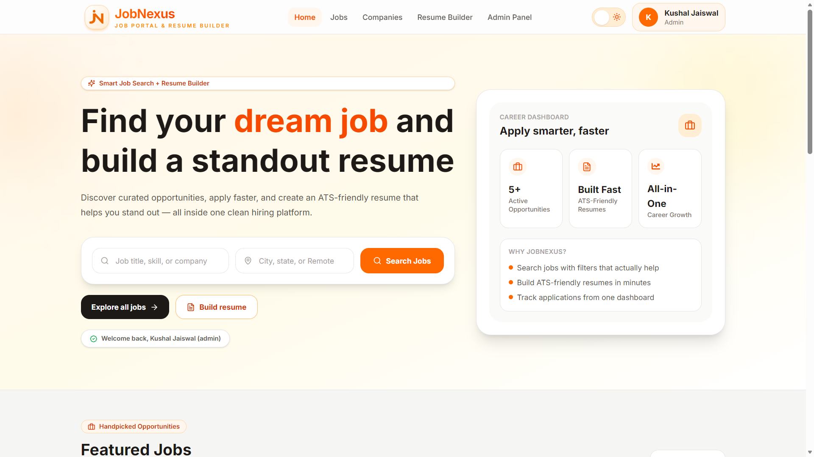

### Jobs Page
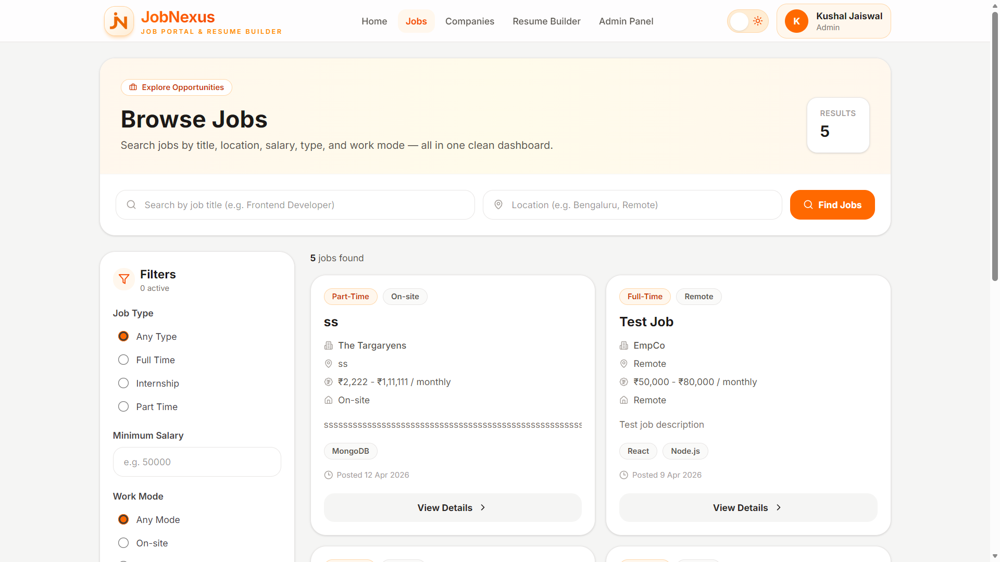

### Companies Page
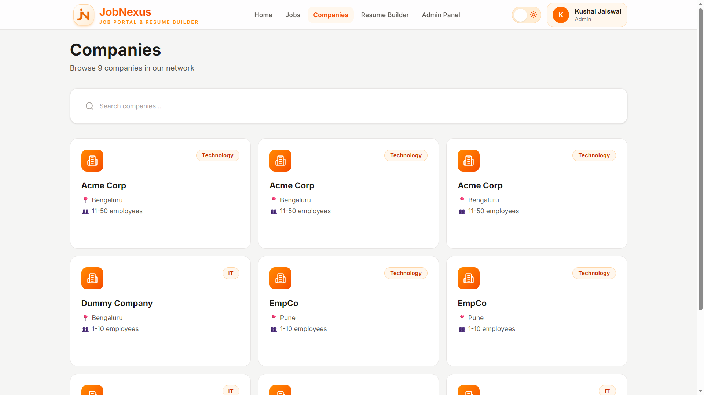

### Company Profile Page
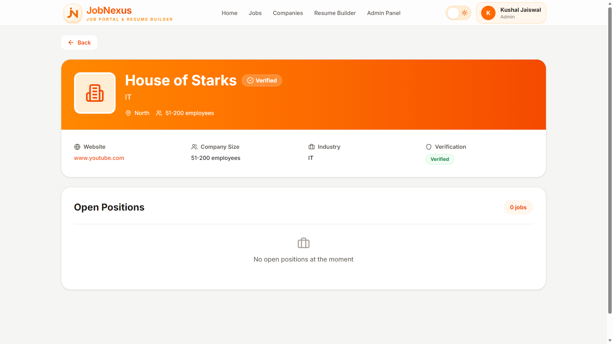

### Login Page
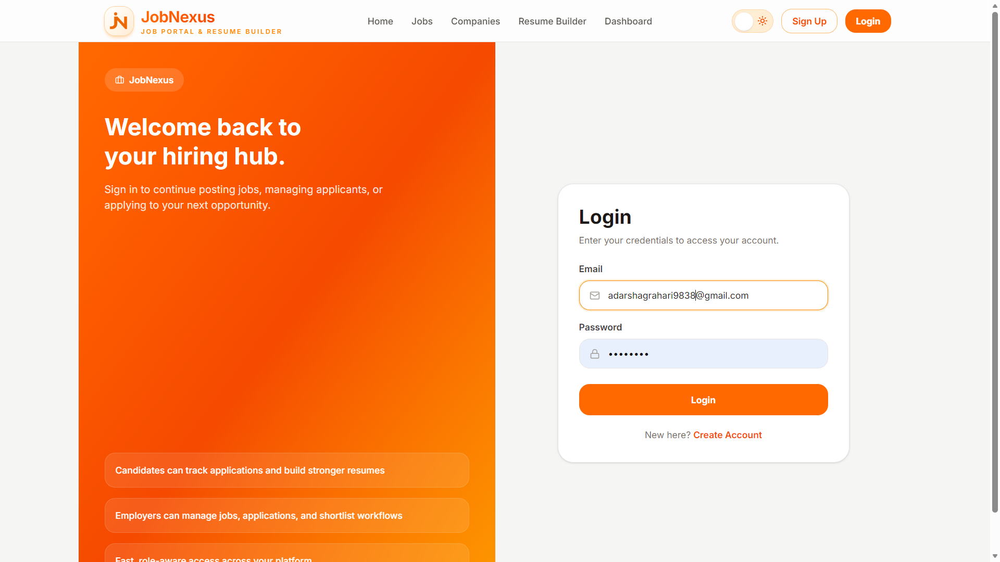

### Resume Builder Page
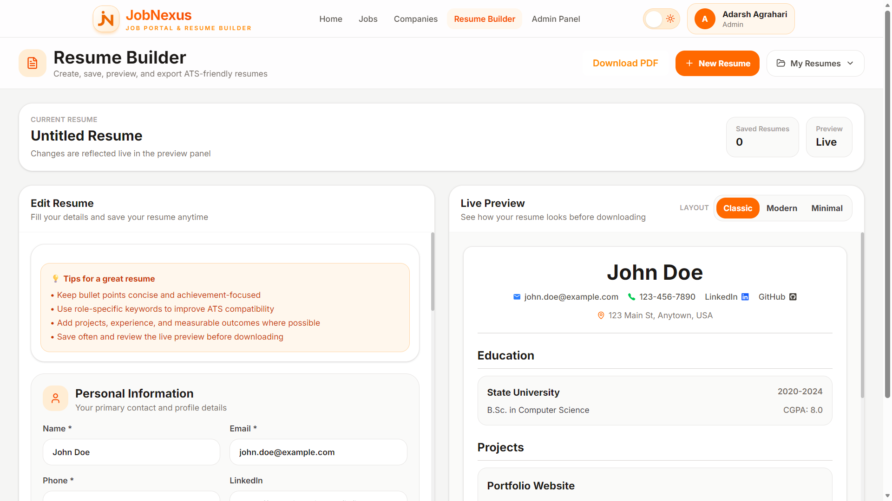

### Admin Dashboard Page
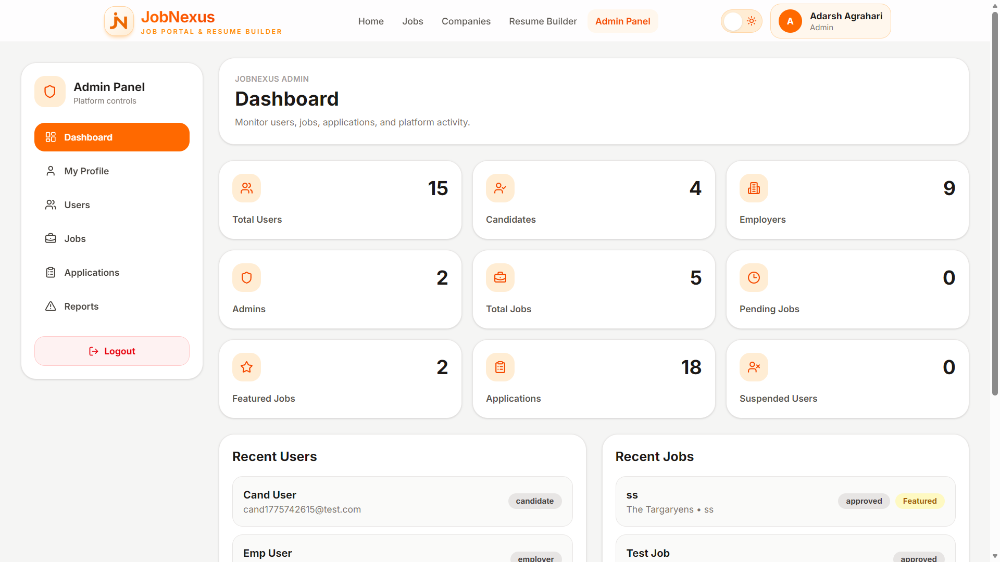

### Job Details Page
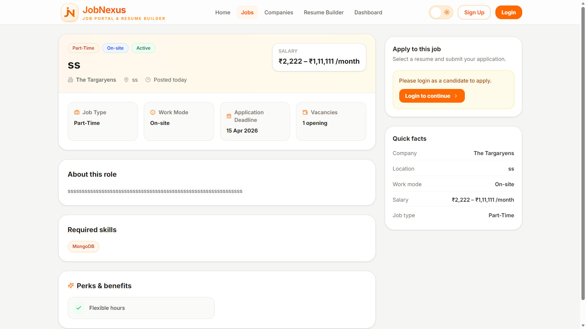

### Employer: Post Job Page
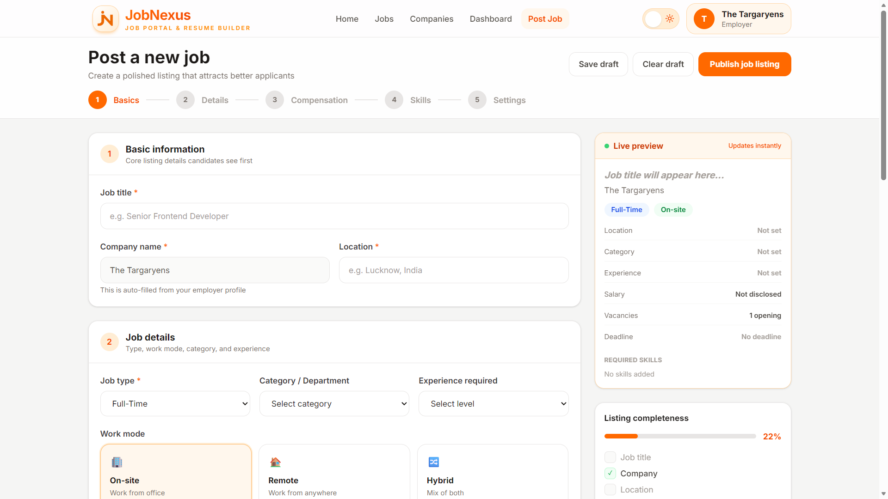

### Home Page (Dark)
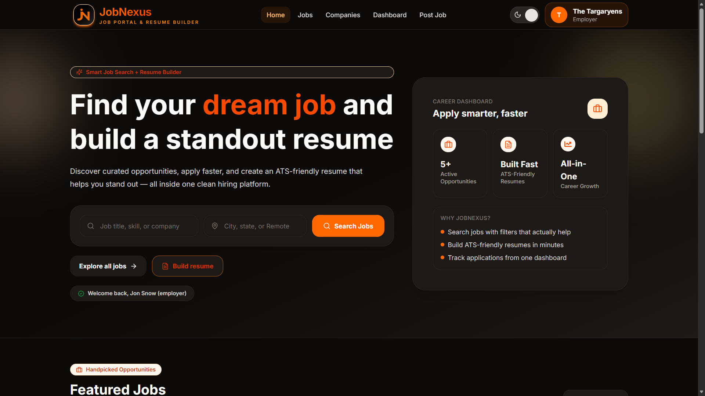

### Employer Dashboard Page
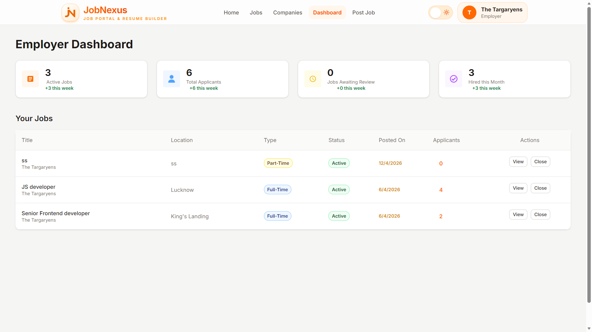

### Employer: Job Applicants Page
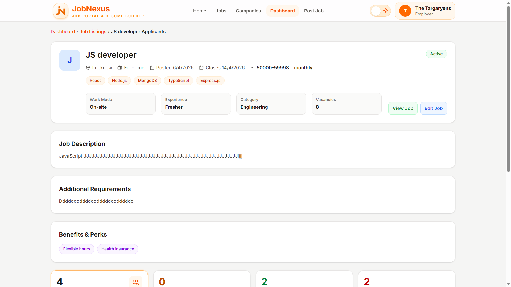

### Employer: Applicants List Page
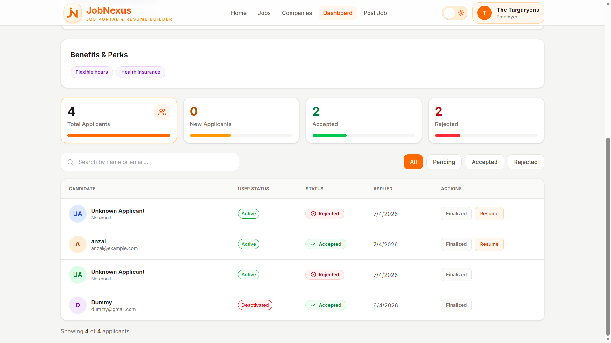

### Candidate Dashboard: My Applications Page
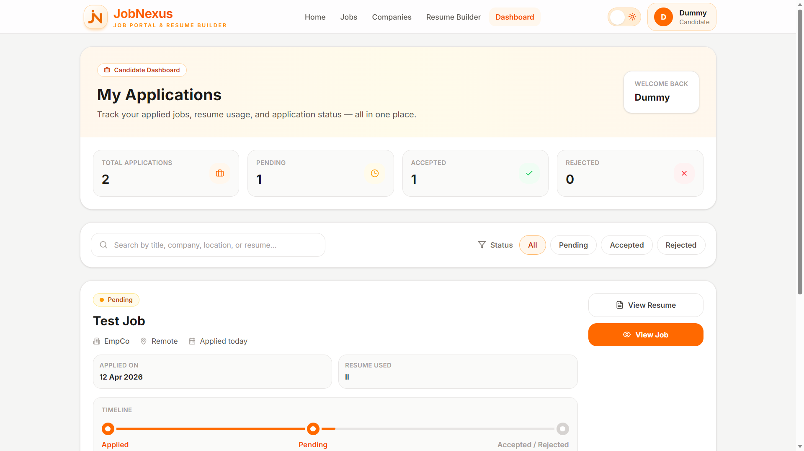

### Candidate Applications Timeline Page
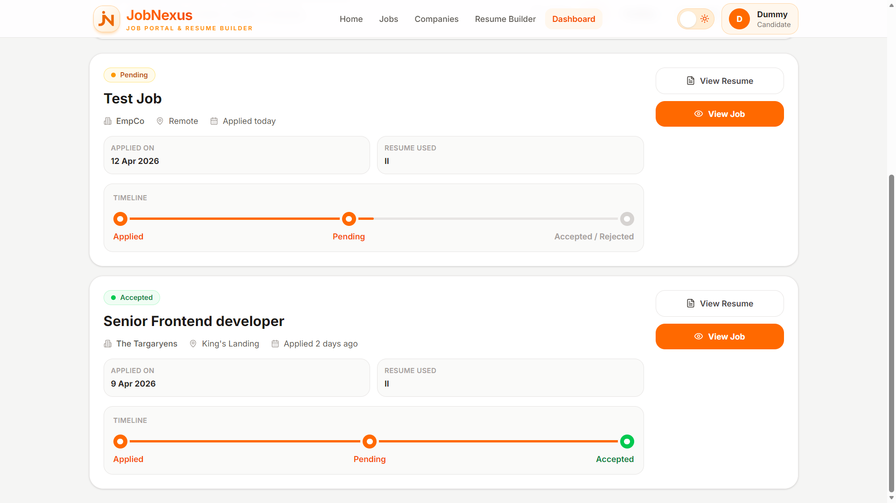

### Candidate Profile Page
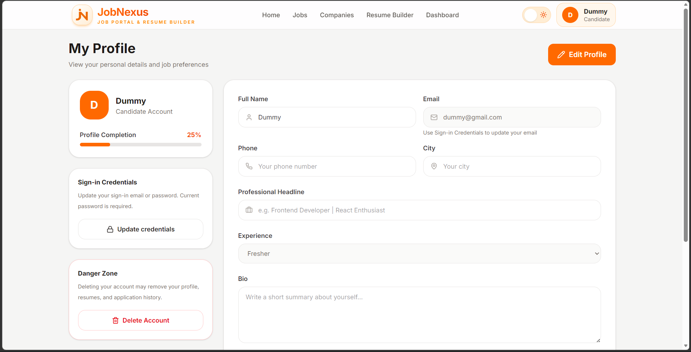


## Why I Built This

I built **JobNexus** to create a complete recruitment workflow in a single platform — from resume creation to job applications and hiring management.

The goal was to simulate a **real-world, full-stack product** where:

- Candidates can create ATS-friendly resumes and apply confidently
- Employers can manage job listings and applicant pipelines
- Admins can moderate platform activity and maintain trust

This project helped strengthen my skills in:

- Full-stack MERN architecture
- Authentication and authorization
- Role-based access control
- REST API design
- State and session management
- Resume/PDF generation workflows
- Real-world deployment with Vercel and Render

---

## Author

**Adarsh Agrahari**

- GitHub: [@yourusername](https://github.com/Adarsh-dev-04)
- LinkedIn: [Your LinkedIn](https://www.linkedin.com/in/adarsh-agrahari-366727234/)

---

## License

This project is licensed under the [**MIT License**](LICENSE).

---

## Final Notes

If you're reviewing this project as a recruiter, interviewer, or developer:

- This is a **real-world MERN full-stack application**
- It demonstrates **multi-role architecture**
- It includes **JWT cookie auth**, **role-based protection**, **resume generation**, and **deployment-ready structure**
- It is actively being improved with stronger validation, testing, and security hardening
