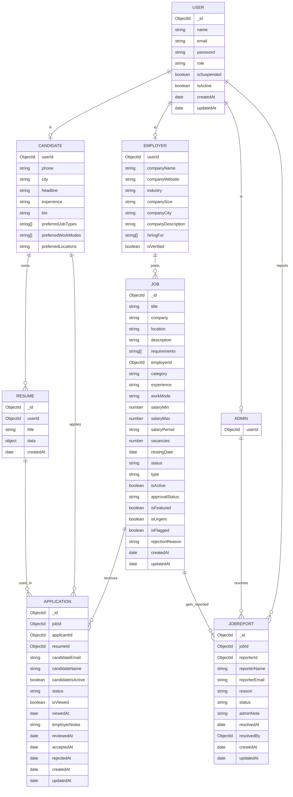

# Entity Relationship Diagram (ERD)

This project uses MongoDB (via Mongoose), so the ERD below describes *logical* relationships between collections based on `ref` fields.

## Mermaid ER diagram

Paste this into any Mermaid renderer (GitHub Markdown preview supports Mermaid in many contexts, and VS Code works well with a Mermaid extension).

## Use in a Word (DOCX) synopsis

### Option A (recommended): export as image via Mermaid Live

1. Open https://mermaid.live
2. Paste the Mermaid block above (everything inside the code fence).
3. Click **Export** → choose **PNG** (best for Word) or **SVG** (crisper, but Word handling varies).
4. In Word: **Insert → Pictures** → pick the exported file.

### Option B: screenshot (quick)

1. Render the diagram (Mermaid Live or VS Code preview).
2. Take a screenshot and insert it into Word.

Tip: In Word, set **Wrap Text → Square** to position it nicely.

## How to generate/update

- Source of truth is in the Mongoose models:
  - `backend/models/User.js`
  - `backend/models/Job.js`
  - `backend/models/Application.js`
  - `backend/models/resume.js`
  - `backend/models/JobReport.js`

If you add a new `ref` field or a new collection, update the Mermaid block accordingly.
